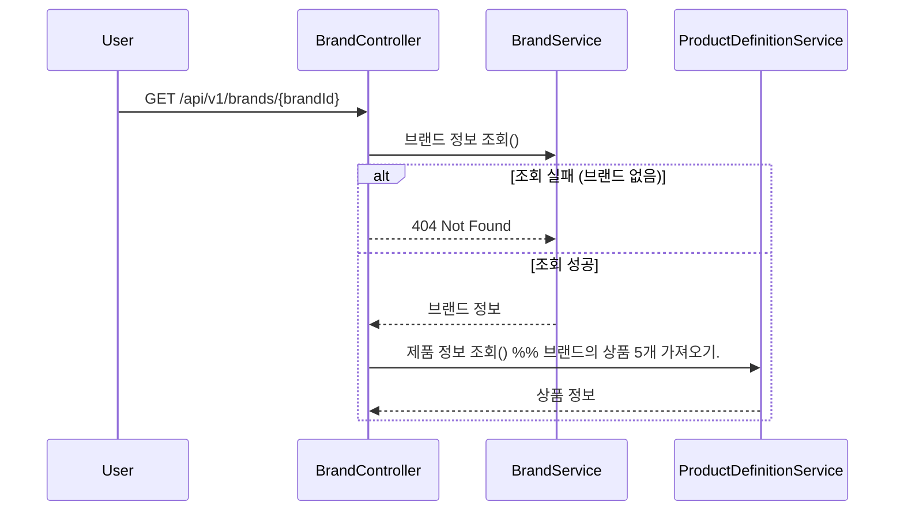
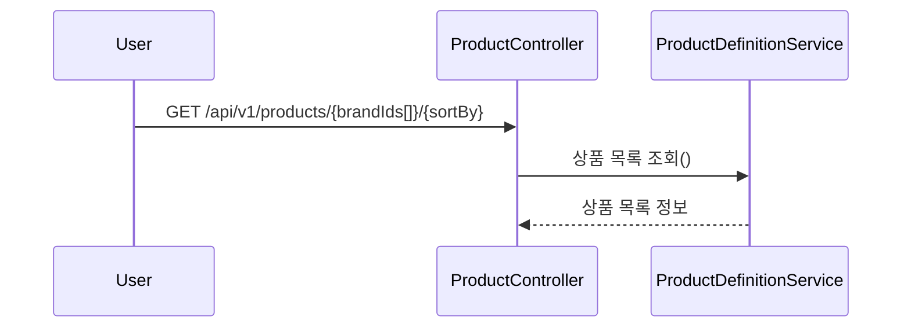
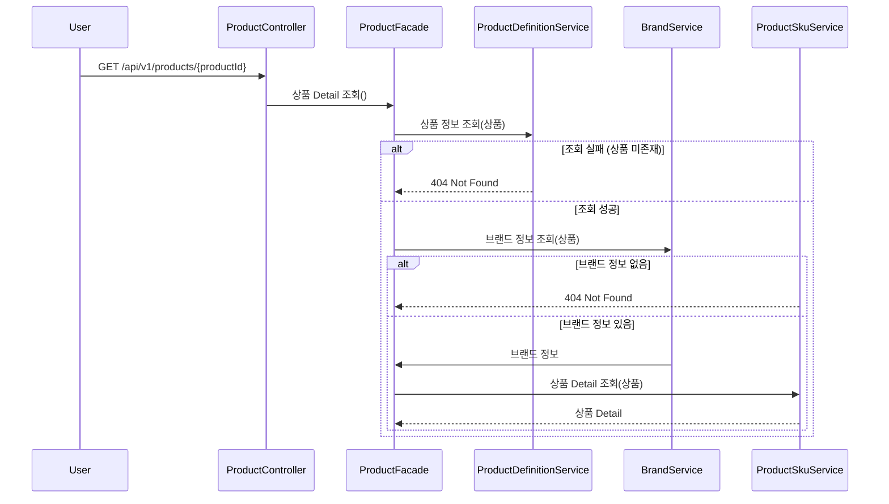
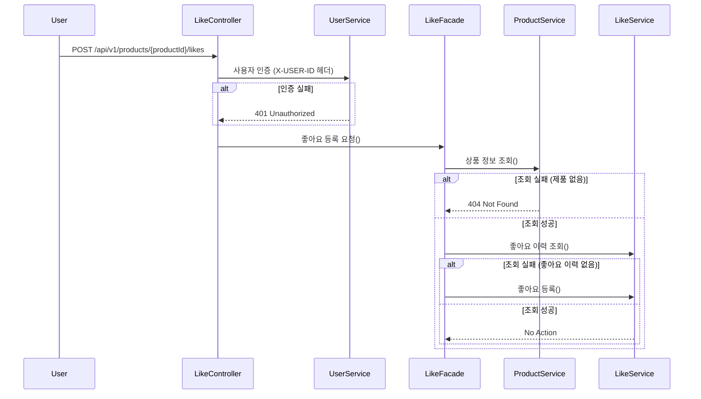
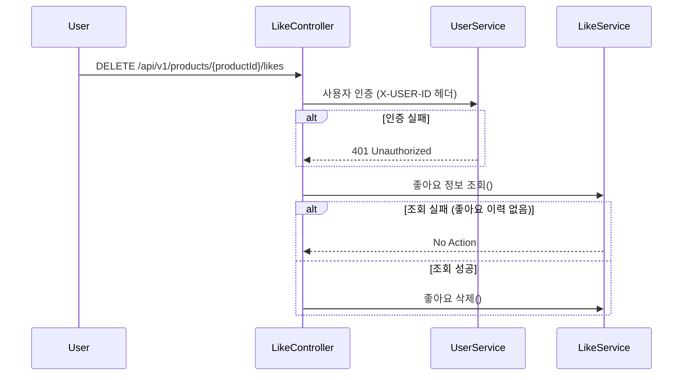
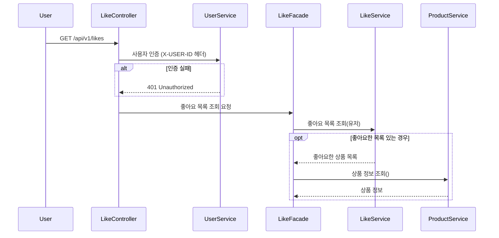
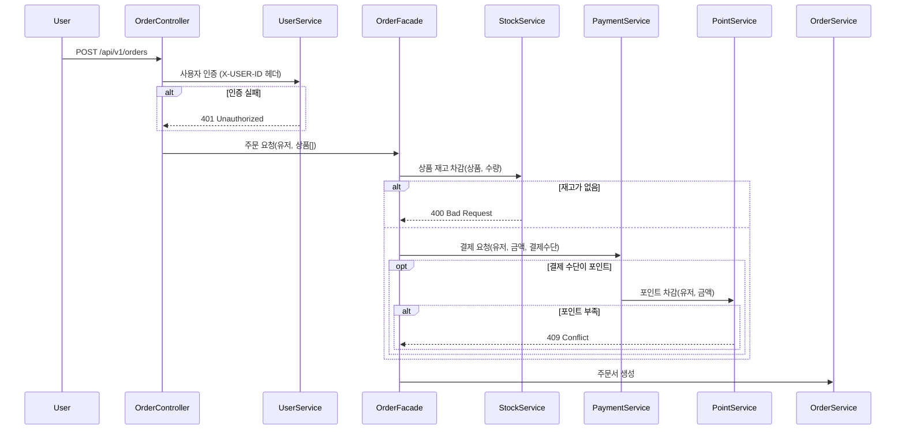
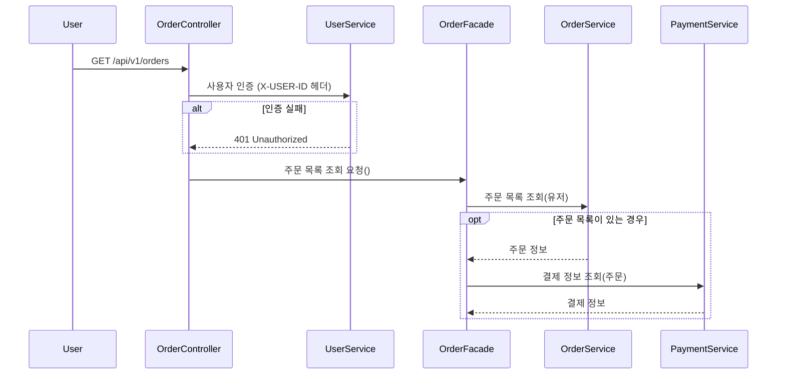
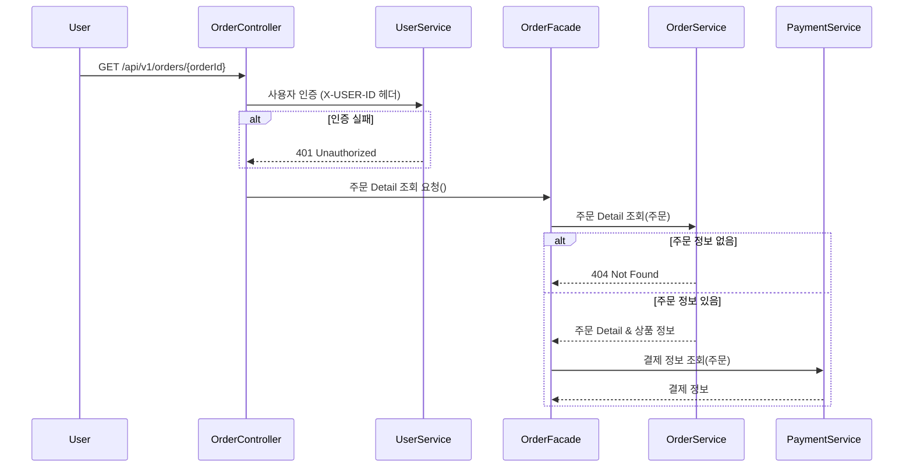

# 02-sequence-diagrams

## 상품

### [유저 스토리]

- **브랜드 정보를 조회할 수 있다.**

### [유저 스토리]

- **상품 목록을 조회할 수 있다.**
- **상품 목록 조회 시, 필터링과 정렬 기능을 사용할 수 있다.**

### [유저 스토리]

- **상품 상세 정보를 조회할 수 있다.**

## 좋아요

### [유저 스토리]

- **상품에 좋아요를 등록한다.**

### [유저 스토리]

- 좋아요를 취소할 수 있다.

### [유저 스토리]

- **내가 좋아요 한 상품 목록을 조회한다.**

## 주문

### [유저 스토리]

- **사용자는 주문을 할 수 있다.**

### [유저 스토리]

- **사용자의 주문 목록을 조회할 수 있다.**

### [유저 스토리]

- **단일 주문 상세 조회를 할 수 있다.**

