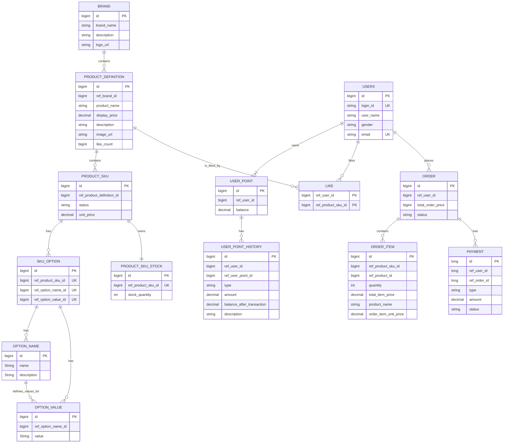

# 04-erd

```mermaid
erDiagram
	BRAND{
		bigint id PK
		string brand_name
		string description 
		string logo_url
	}
	
	PRODUCT_DEFINITION{
		bigint id PK
		bigint ref_brand_id
		string product_name
		decimal display_price
		string description
		string image_url
		bigint like_count
	}
	
	PRODUCT_SKU{
		bigint id PK
		bigint ref_product_definition_id
		string status
		decimal unit_price
		%% int stock_quantity
	}
	
	SKU_OPTION{
		bigint id PK
		bigint ref_product_sku_id UK
		bigint ref_option_name_id UK
		bigint ref_option_value_id UK
	}
	
	OPTION_VALUE{
		bigint id PK
		bigint ref_option_name_id
		String value
	}

	OPTION_NAME{
		bigint id PK
		String name
		String description
	}

	PRODUCT_SKU_STOCK{
		bigint id PK
		bigint ref_product_sku_id UK
		int stock_quantity
	}
	
	USERS {
		bigint id PK
		string login_id UK
		string user_name
		string gender
		string email UK
	}
	
	%% 별도의 id 가 필요한가?
	USER_POINT{
		bigint id PK
		bigint ref_user_id
		decimal balance
	}
	
	USER_POINT_HISTORY{
		bigint id PK
		bigint ref_user_id
		bigint ref_user_point_id
		string type
		decimal amount
		decimal balance_after_transaction
		string description
	} 
	
	LIKE{ 
		bigint ref_user_id PK
		bigint ref_product_sku_id PK
	}
	
	ORDER{
		bigint id PK
		bigint ref_user_id
		bigint total_order_price
		string status
	}
	
	ORDER_ITEM{
		bigint id PK
		bigint ref_product_sku_id
		bigint ref_product_id
		int quantity
		decimal total_item_price
		string product_name
		decimal order_item_unit_price
		%% 주문 시의 상품 Snapshot 을 위해, ProductSku 의 일부 컬럼 추가
	}
	
	PAYMENT{
		long id PK
		long ref_user_id
		long ref_order_id
		string type
		decimal amount
		string status
	}
	
	BRAND ||--o{ PRODUCT_DEFINITION : contains
	PRODUCT_DEFINITION ||--o{ PRODUCT_SKU : contains
	PRODUCT_SKU ||--o{ SKU_OPTION : has
	OPTION_NAME ||--o{ OPTION_VALUE : defines_values_for
	SKU_OPTION ||--o{ OPTION_NAME : has
	SKU_OPTION ||--o{ OPTION_VALUE : has
	USERS ||--|{ USER_POINT: owns
	USER_POINT ||--o{ USER_POINT_HISTORY: has
	USERS ||--o{ LIKE : likes
	PRODUCT_DEFINITION ||--o{ LIKE : is_liked_by
	USERS ||--o{ ORDER : places
	ORDER ||--o{ ORDER_ITEM : contains
	ORDER ||--o{ PAYMENT : has
	PRODUCT_SKU ||--|| PRODUCT_SKU_STOCK : owns
```
